# UNmemos

A faithful [Memos](https://github.com/usememos/memos)-inspired flash-capture plugin for Obsidian. Type a thought, hit send, and it lands on a beautiful timeline — everything stored locally as native Obsidian Canvas files.

> Part of the **UN series** by [UNcore](https://github.com/UNcore-gh). ⚡ ~20ms load time — capture ideas before you even finish thinking.

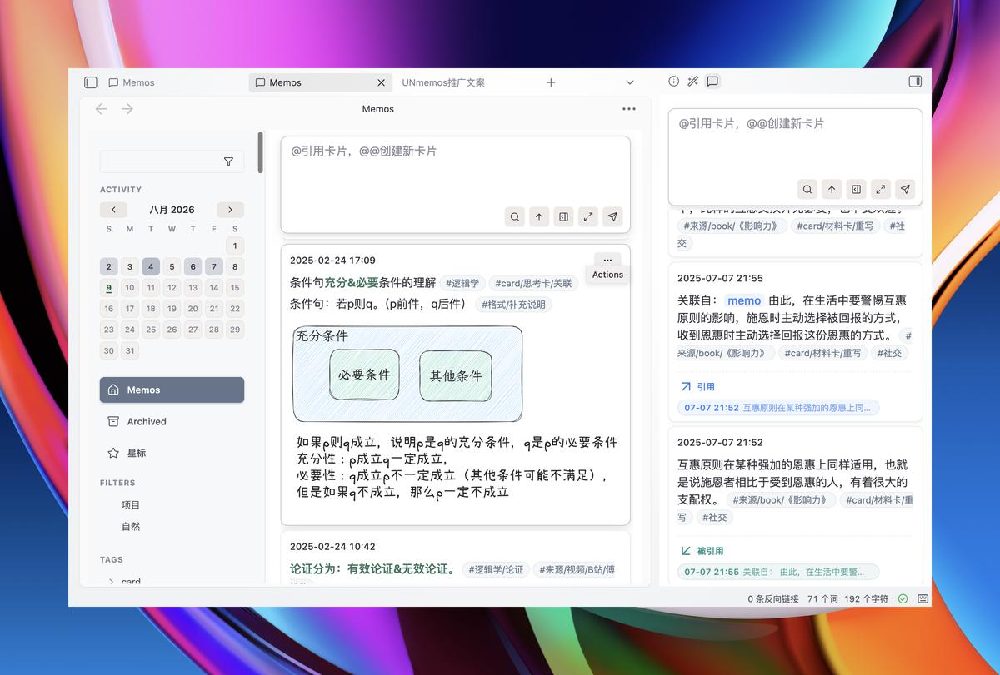

## ✨ Features

| Feature | Description |
|---------|-------------|
| **⚡ Flash Capture** | Top input box with `Cmd/Ctrl+Shift+M` shortcut; drafts auto-saved, crashes don't lose your thoughts |
| **📅 Timeline** | Chronological memo cards grouped by day, plus an activity heatmap |
| **🏷️ Smart Tags** | Auto-extract `#tags` from text; sidebar tree with pinning, drag-reorder, and one-click filtering |
| **⭐ Star & Archive** | Bookmark important memos; configurable auto-deletion for archived items |
| **🔍 Advanced Filters** | Full-text / tag / date range filtering with flomo-style saved presets |
| **@ Mention System** | In *any* editor — source mode, live preview, canvas nodes — type `@` to reference or `@@` to create new linked memos |
| **✍️ Inline Editing** | Click any card to edit with full Markdown support: `#tags`, `[[wikilinks]]`, `![[embeds]]`, code blocks |
| **🧩 Canvas-Native Storage** | Memos stored as `.canvas` files (`Memos/{year}.canvas`) — first-class Obsidian citizens |
| **🔗 Bidirectional Links** | Uses Obsidian's native linking engine — hover previews, backlink counts, seamless integration with all community plugins |
| **🔄 Flomo Import** | Built-in AI-guided migration tool to import your flomo notes with tags, images, and links intact |
| **🌐 Bilingual UI** | Chinese / English interface; custom accent color; full mobile responsive design |

## 🖥️ Platform Support

Fully tested across all platforms:

| Platform | Status | Details |
|----------|--------|---------|
| Desktop (macOS/Windows/Linux) | ✅ | Full keyboard shortcuts, three-column layout |
| Tablet (iPadOS) | ✅ | Responsive layout adapted for larger touch screens |
| Mobile (iOS) | ✅ | Touch-optimized with adaptive input field behavior |

## 🔒 Privacy

UNmemos is **fully offline**:

- Zero network requests
- Zero telemetry collection
- Data lives entirely within your vault (`.canvas` files)
- Optional debug log is strictly opt-in, in-memory only, exported by you

No accounts. No cloud. No background processes.

---

# 中文说明

**UNmemos** 是一款受 [Memos](https://github.com/usememos/memos) 和 flomo 启发的闪念速记插件，专为 Obsidian 用户打造。**随手一条想法，秒存时间线——所有数据都以 Obsidian 原生 Canvas 文件保存。**

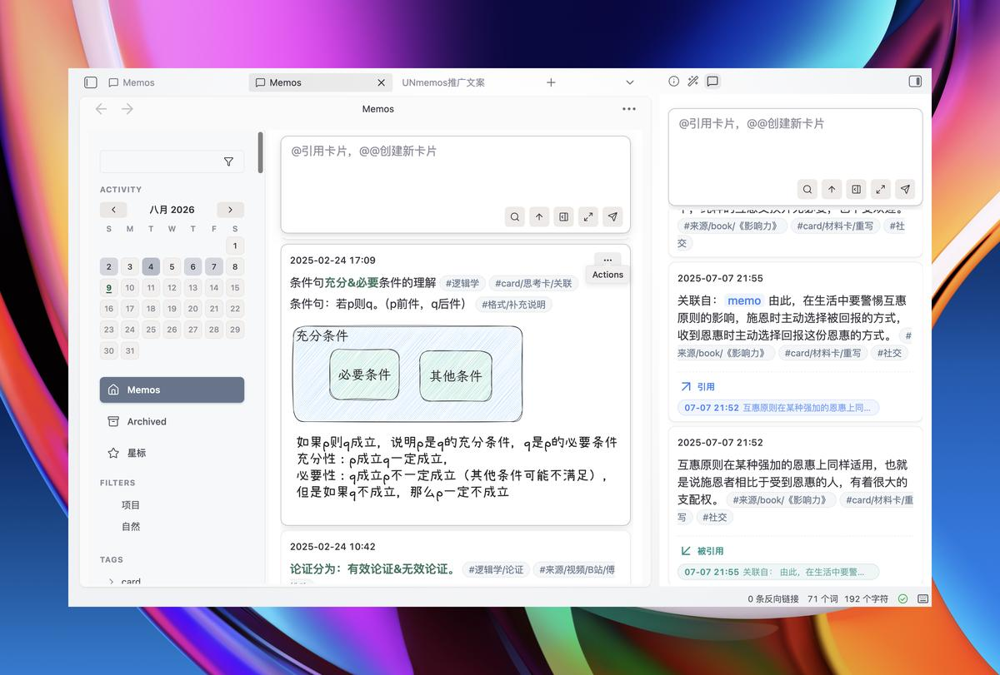

## 🚀 功能一览

| 功能 | 说明 |
|------|------|
| **⚡ 闪念速记** | 顶部输入框随时打开；`Cmd/Ctrl+Shift+M` 快速启动，`+N` 直达输入框；草稿自动保留，崩溃不丢灵感 |
| **📅 时间线** | 按天分组的卡片流 + 月度活跃度热力图，一眼看到你的思维脉搏 |
| **🏷️ 标签系统** | 正文 `#标签` 自动提取到侧边栏树形结构，支持置顶、拖拽排序、一键过滤 |
| **⭐ 星标与归档** | 重要内容加星标；归档内容可设置保留天数后自动清理（默认不清理） |
| **🔍 高级过滤** | 全文搜索 / 标签筛选 / 日期范围组合过滤，flomo 风格的已保存快捷方式一键复用 |
| **@ 提及系统** | 在**任意编辑器**（源码 / 实时预览 / 白板文本节点）输入 `@` 引用已有 memo，`@@名字` 快速新建并关联 |
| **✍️ 卡片内联编辑** | 点击卡片即可修改，完整 Markdown 支持：`#标签`、`[[双链]]`、`![[嵌入]]`、代码块等 |
| **🧩 Canvas 原生存储** | 数据存在 `Memos/{年份}.canvas` 文件中，Obsidian 第一公民——白板视图中直接拖拽排列，双向同步 |
| **🔗 双向链接集成** | 底层使用 Obsidian 内置双链引擎，天然适配：悬浮预览、反链计数、与任何第三方插件完美配合 |
| **🔄 Flomo 导入** | 设置页内置 AI 引导的导入指南，一键迁移浮墨笔记数据（含标签、图片、双链） |
| **🌐 双语界面** | 中文 / English 界面无缝切换；自定义主题色；移动端完整适配 |

## 🖥️ 平台支持

全平台全面适配，体验一致流畅：

| 平台 | 状态 | 说明 |
|------|------|------|
| 桌面端 (macOS/Windows/Linux) | ✅ | 完整快捷键支持，三栏布局 |
| 平板端 (iPadOS) | ✅ | 大屏响应式布局，操作空间充裕 |
| 手机端 (iOS) | ✅ | 触摸交互优化，随时随地捕捉闪念 |

## 🔒 隐私安全

UNmemos **完全离线运行**：

- 零网络请求
- 零遥测数据收集
- 数据存储 100% 本地（你的 Vault）
- 可选调试日志默认关闭，仅存在于内存中，由你主动导出

没有账号、没有云端、没有后台。只读写你自己的 canvas 文件。

---

## Installation

### Community Plugins (Recommended)

Search **"UNmemos"** in Obsidian → Settings → Community Plugins → Browse → Install.

### Manual

1. Download the latest release files (`main.js`, `styles.css`, `manifest.json`) from [Releases](https://github.com/UNcore-gh/UNmemos/releases)
2. Copy them into `<vault>/.obsidian/plugins/unmemos/`
3. Reload Obsidian and enable the plugin

## Usage

### Quick Start

```
1. Open UNmemos view: Cmd/Ctrl+Shift+M
2. Type your thought in the top input box
3. Press Enter or click the send button
4. Your memo appears on the timeline instantly
```

### @ Mention System

Type `@` in **any** editor context to reference existing memos:
- Hover over references for inline preview
- Check backlinks to see how your knowledge network grows
- Use `@@name` to quickly create a new memo and link it in one step

The `@` syntax works everywhere in Obsidian — not just inside UNmemos views.

## Screenshots

### Key Features

| Canvas Storage | @ Mention Picker | @@ Create Card | Global Syntax |
|----------------|------------------|----------------|---------------|
| 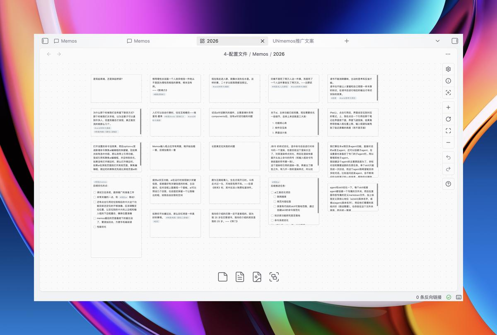 | 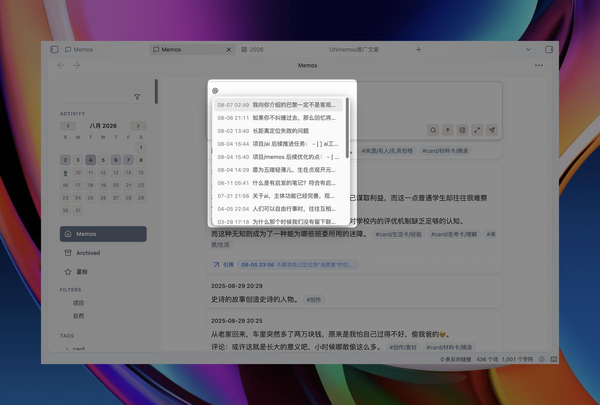 | 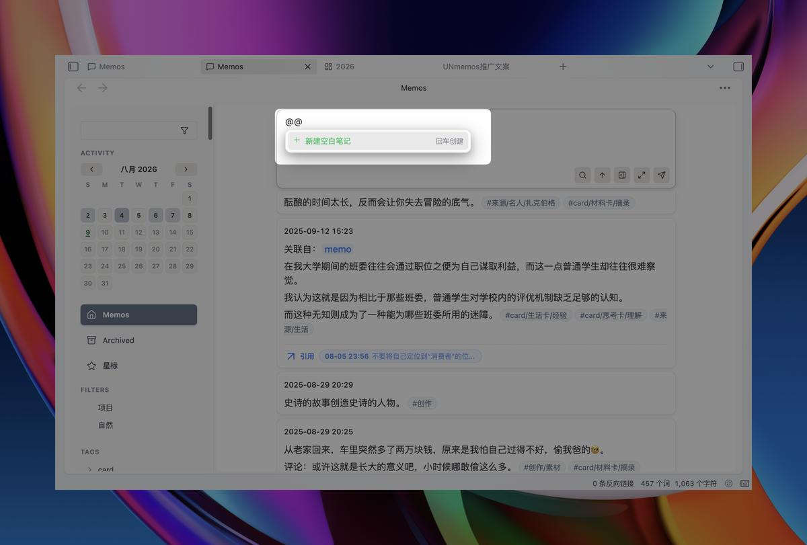 | 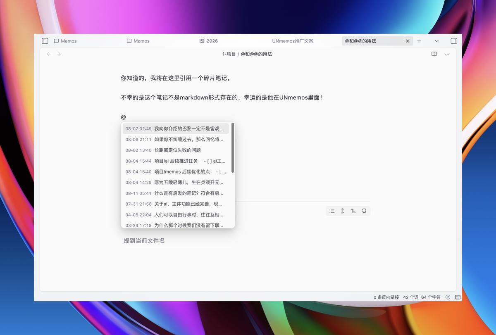 |

### Organization Tools

| Tags & Filters | Pinned & Starred | Native Links | Performance |
|----------------|------------------|--------------|-------------|
| 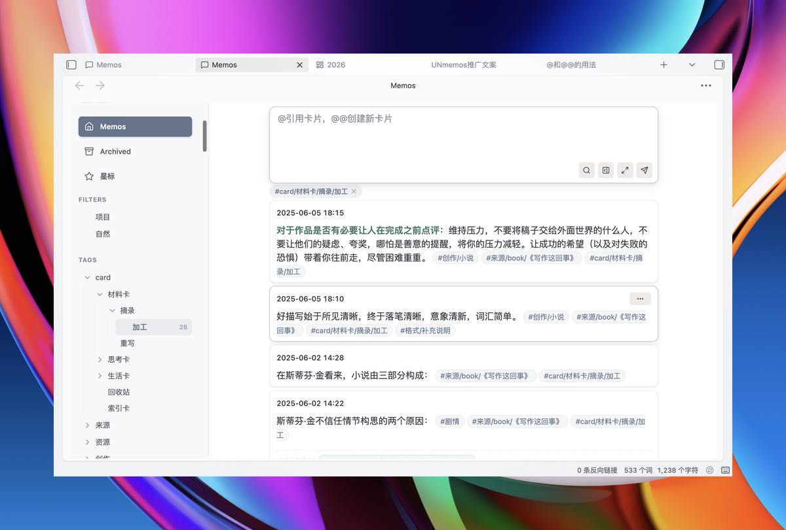 | 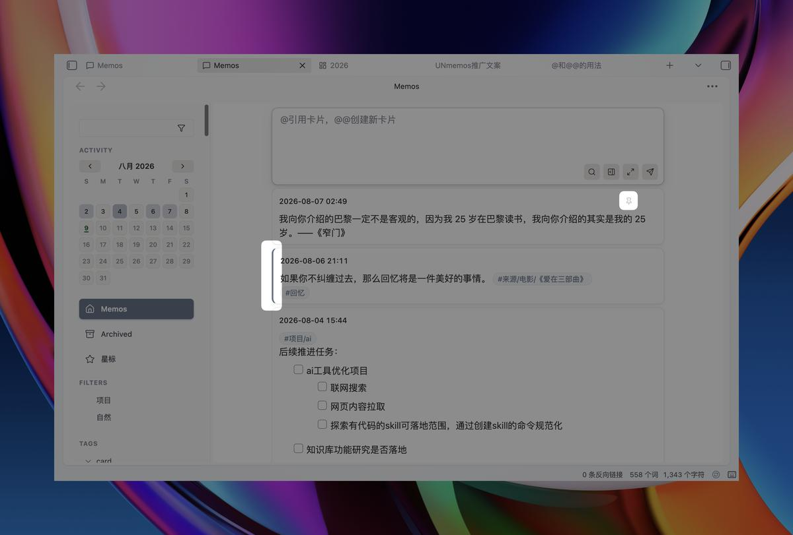 | 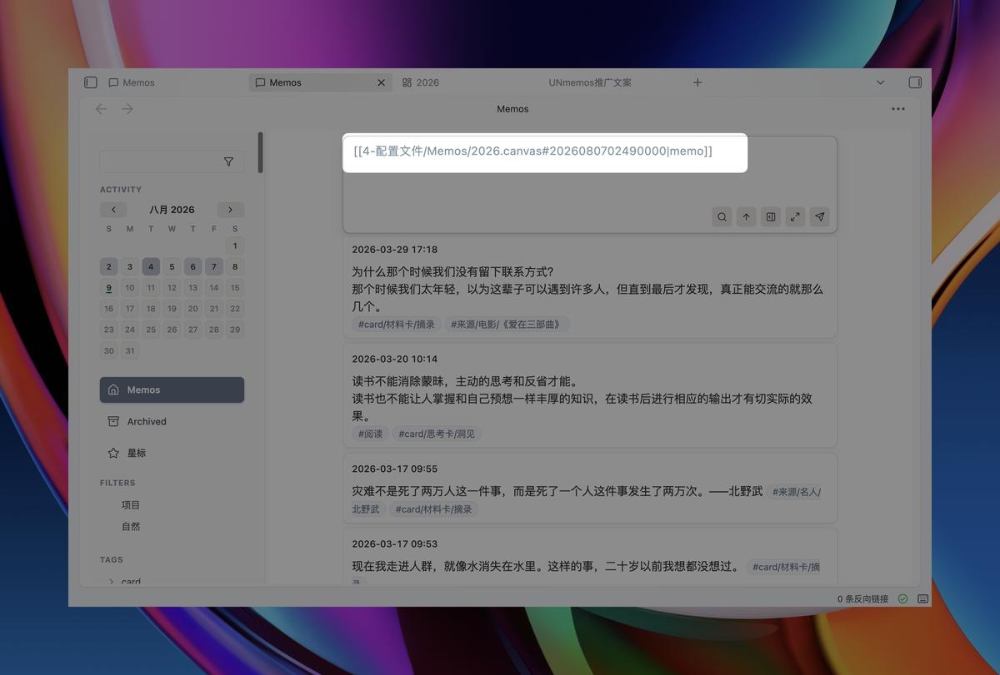 | 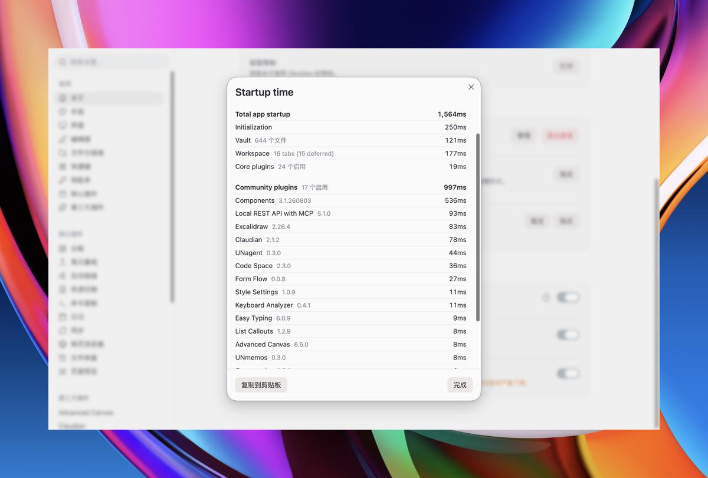 |

### Mobile Views

| Tablet (Collapsed) | Tablet (Expanded) | Mobile (Collapsed) | Mobile (Expanded) |
|--------------------|--------------------|--------------------|--------------------|
| 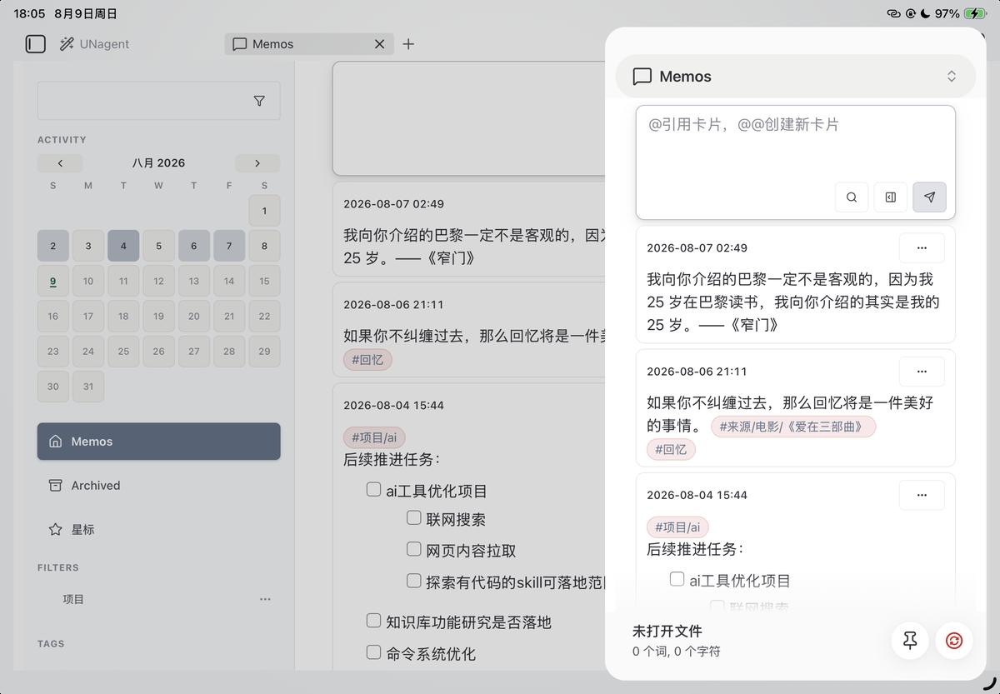 | 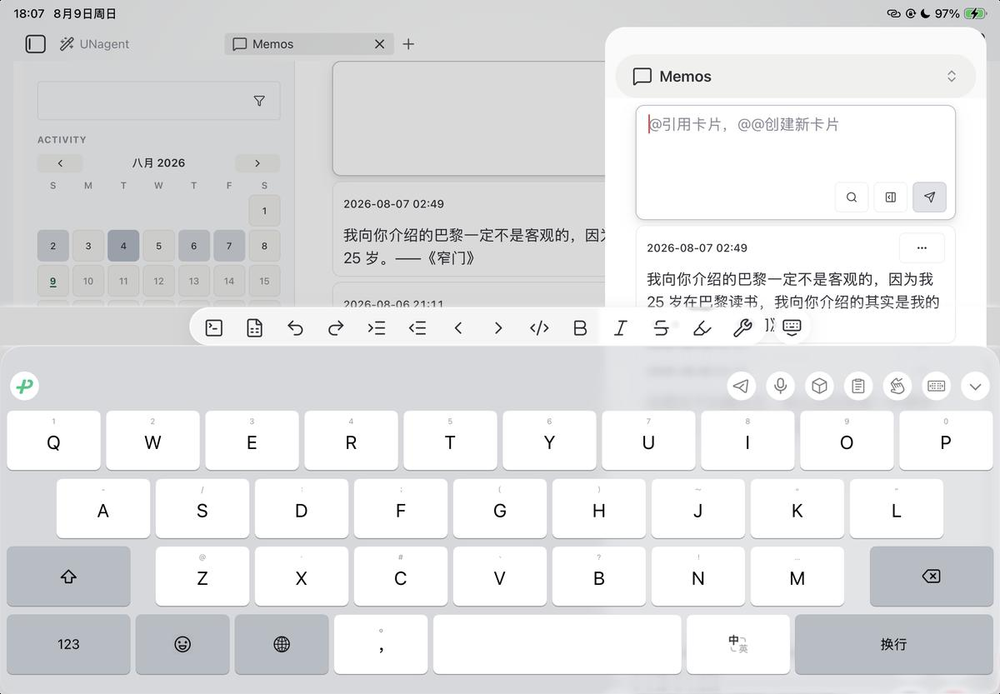 | 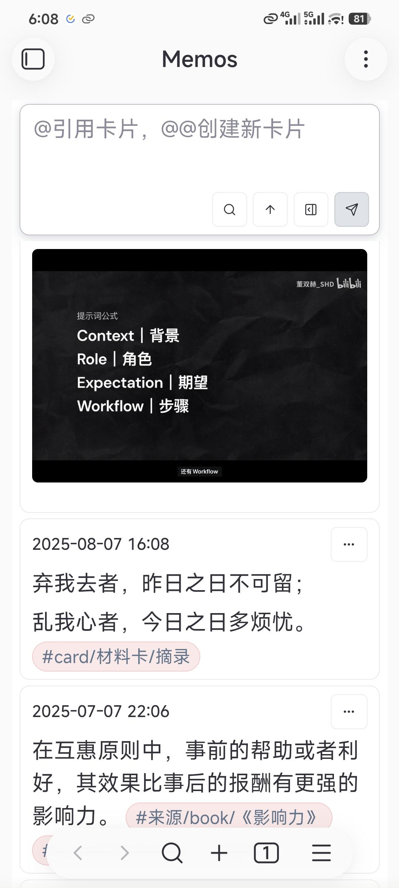 | 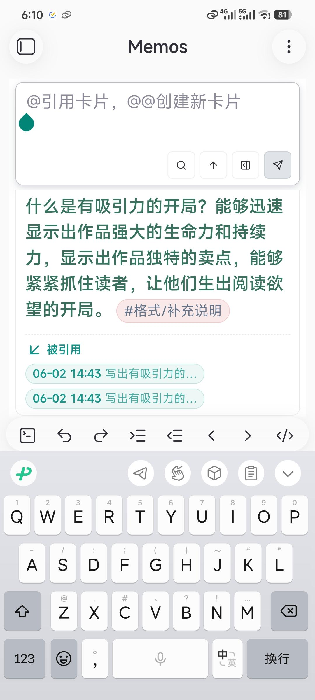 |

## License

[0BSD](LICENSE)

## Support

Enjoying UNmemos? Consider supporting development:

- ⭐ Star this repo
- 🐛 Report bugs via [GitHub Issues](https://github.com/UNcore-gh/UNmemos/issues)
- 💡 Suggest features via [GitHub Discussions](https://github.com/UNcore-gh/UNmemos/discussions)
